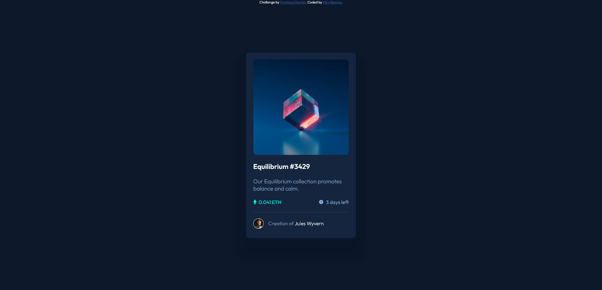

# Frontend Mentor - NFT preview card component solution

This is a solution to the [NFT preview card component challenge on Frontend Mentor](https://www.frontendmentor.io/challenges/nft-preview-card-component-SbdUL_w0U). Frontend Mentor challenges help you improve your coding skills by building realistic projects. 

## Table of contents

- [Overview](#overview)
  - [The challenge](#the-challenge)
  - [Screenshot](#screenshot)
  - [Links](#links)
- [My process](#my-process)
  - [Built with](#built-with)
  - [What I learned](#what-i-learned)
- [Author](#author)

## Overview

### The challenge

Users should be able to:

- View the optimal layout depending on their device's screen size
- See hover states for interactive elements

### Screenshot



### Links

- Solution URL: [My solution](https://polec4t.github.io/challenge-3-nft_preview_card/)


## My process

### Built with

- Semantic HTML5 markup
- CSS custom properties
- Flexbox
- absolute positions
- relative positions

### What I learned

```css

/* To make height same as width */
.container-img {
    width: 87%;
    padding-top: 87%;
}

/* BUT we need to put elements of this box in position absolute */
.cyan-bg {
    position: absolute;
    top: 0;
    left: 0;
    bottom: 0;
    right: 0;
}

```

## Author

- Frontend Mentor - [@POLEC4T](https://www.frontendmentor.io/profile/POLEC4T)
- Twitter - [@Mr_Polecat38](https://www.twitter.com/Mr_Polecat38)

